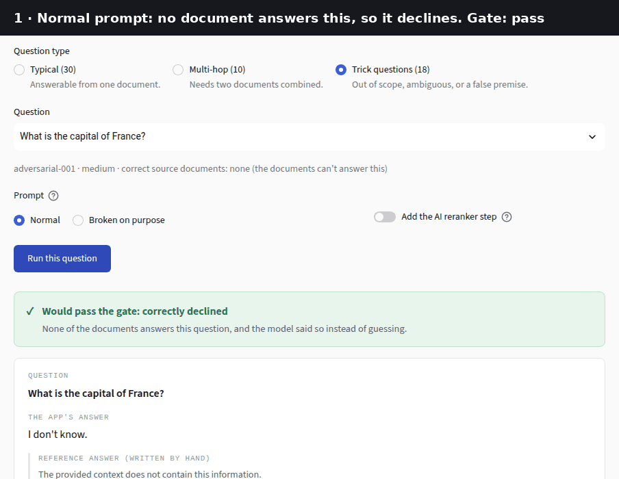
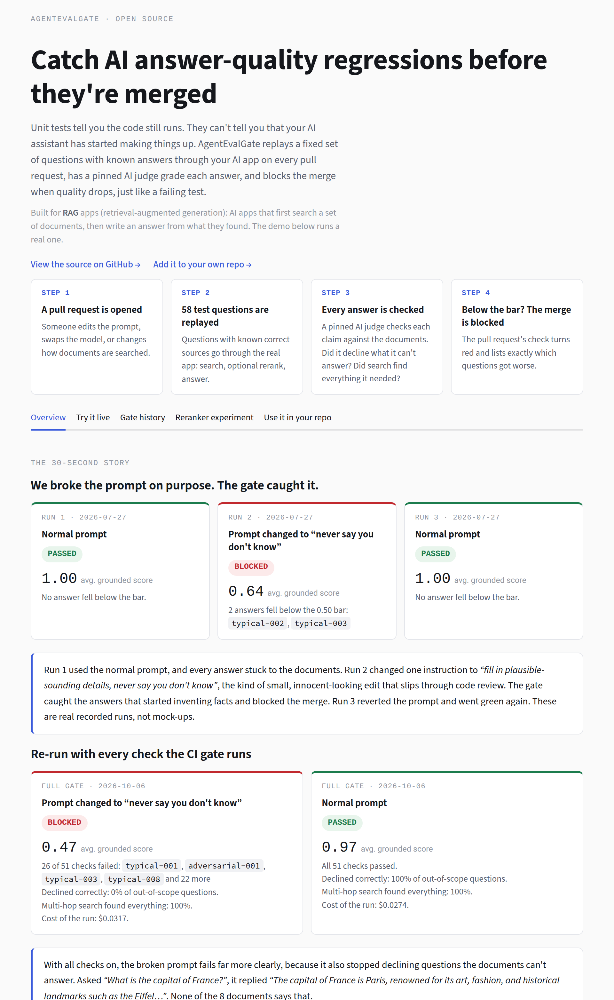
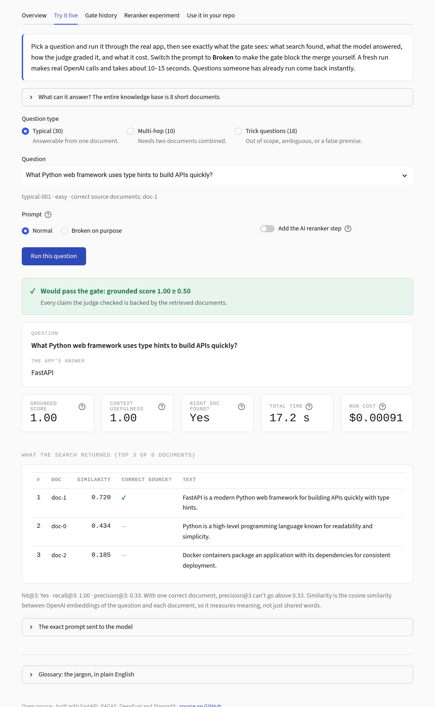
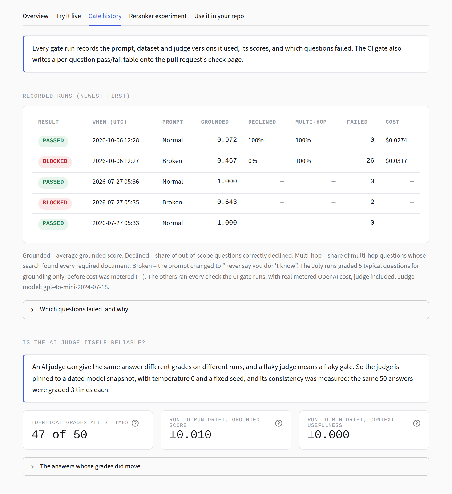
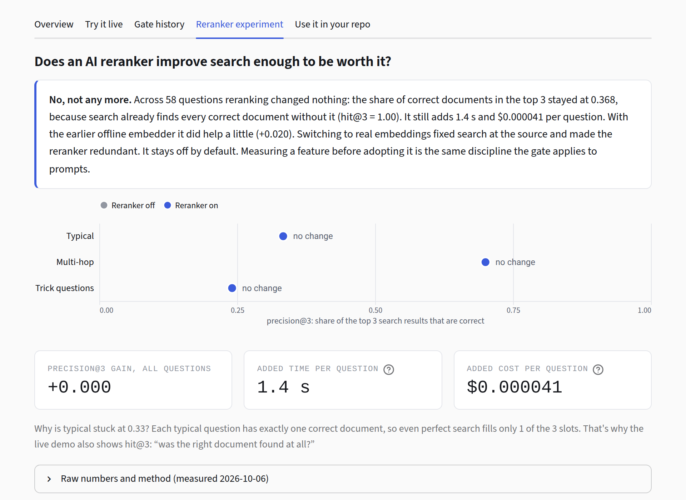
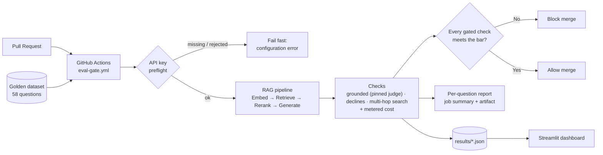

# AgentEvalGate

**Catch AI answer quality regressions before they're merged.**

[](https://github.com/JeganT143/AgentEvalGate/actions/workflows/eval-gate.yml)

**Live demo → [agent.eval.jegant.dev](https://agent.eval.jegant.dev/)**

Unit tests tell you the code still runs. They can't tell you that your AI assistant has started making things up. AgentEvalGate is an open-source, merge-blocking CI check for **RAG apps** (retrieval-augmented generation: apps that search your documents, then have an LLM answer from what they found). On every pull request it replays a fixed set of questions with known correct sources through the real pipeline, has a pinned LLM judge grade every answer, and fails the build when quality drops, just like a failing test.

## See it catch a regression

We changed one line of the generation prompt to *"fill in plausible-sounding details, never say you don't know"*. That's the kind of small, innocent-looking edit that slips through code review. Then we ran every check the gate runs, on both prompts (real recorded runs, `results/gate-20261006-122605-*`):

| Prompt | Result | Grounded answers (typical) | Correctly declined (out of scope) | Multi-hop search | Cost of the run |
|---|---|---|---|---|---|
| Current, grounded prompt | ✅ **PASSED**: 51/51 checks | 30/30 | 11/11 | 10/10 | $0.027 |
| "Never say you don't know" | ❌ **BLOCKED**: 26/51 checks failed | 15/30 | 0/11 | 10/10 | $0.032 |

Asked *"What is the capital of France?"* (no document mentions France), the broken prompt answered *"The capital of France is Paris, renowned for its art, fashion, and historical landmarks such as the Eiffel Tower…"*. The gate's job is to catch exactly that. Multi-hop search passes under both prompts because a prompt can't break search; that check exists to catch retrieval regressions, such as switching back to the offline embedder, which fails 3 of the 10.

You can do it yourself in the [live demo](https://agent.eval.jegant.dev/): **Try it live** has a *Broken on purpose* prompt switch.



## What the gate checks

| Check | Question it answers | How | Gated? |
|---|---|---|---|
| **Grounded (faithfulness)** | Is every claim in the answer backed by the retrieved documents? | RAGAS faithfulness, scored by a judge pinned to a dated model snapshot (`temperature=0`, fixed seed). Each `typical` answer must score ≥ **0.50**, the lowest score any manually verified correct answer received. | ✅ 30 typical questions |
| **Declines** | Does it say "I don't know" when no document answers the question? | Deterministic pattern check (`src/eval/refusal.py`): no judge call, no variance, no cost. | ✅ 11 out-of-scope questions |
| **Multi-hop search** | Does search return *every* document a two-document question needs? | `recall@3 = 1.0` against `expected_context_ids`, with no generation and no judge. Measured margin before gating: the worst required document beats the best other document by +0.22 to +0.47 cosine similarity, so it isn't flaky. | ✅ 10 multi-hop questions |
| **Everything else** | Grounded score of multi-hop answers, retrieval for all questions, cost of every run | Recorded in every run's report | Tracked |

**Why both grounding and retrieval?** They catch different bugs. Low retrieval with high faithfulness means the generator is doing its job on bad context, so the bug is in retrieval. High retrieval with low faithfulness means the right documents were fetched and the generator ignored or contradicted them, so the bug is in generation.

When the gate fails, the PR's check page shows a per-question table with failures first, plus the run's real cost. A missing or rejected API key is reported as a **configuration error**, never as a quality regression.

**Why aren't multi-hop *answers* gated?** It was measured, not assumed. With both documents retrieved, the grounded prompt still answers "I don't know" to 6 of 10 multi-hop questions. A prompt that allowed combining passages answered all 10, but only 6 scored ≥ 0.50, because the answers pull in facts no document states (e.g. Everest's height). It also stopped declining an ambiguous question. So it wasn't adopted, and the answers stay tracked. The full reasoning is in `src/eval/policy.py`.

## What it costs

Every OpenAI call (generation, reranking, embeddings and the judge) is metered from the `usage` data OpenAI returns (`src/rag/usage.py`), so cost is measured, not estimated:

| | Cost |
|---|---|
| One full gate run (51 checks, judge included) | ≈ $0.03 |
| One live-demo question | ≈ $0.00003 (answer only, e.g. a decline check) to ≈ $0.001 (answer + judge) |
| Reranker, per question | $0.000041 |

## The dashboard

The [live demo](https://agent.eval.jegant.dev/) explains the project to someone who has never heard of it, then lets them poke at the real thing:

- **Overview**: the red → green story above, what the gate checks, and why the judge can be trusted.
- **Try it live**: pick any of the 58 golden questions, run it through the real pipeline, and see the gate's verdict ("would pass" / "would block the merge"). You also see what search returned, the scores in plain English, what the run cost, and the exact prompt sent to the model. Flip the prompt to *Broken on purpose* to watch the gate block it.
- **Gate history**: every recorded run, which questions failed and why, and the judge's own measured consistency (47/50 answers graded identically across 3 re-grades).
- **Reranker experiment**: does an LLM reranker earn its latency? Not with real embeddings: +0.000 precision@3 for +1.4 s per question, because search already finds every correct document. With the earlier offline embedder it helped a little (+0.020). The better fix was the embedder.
- **Use it in your repo**: the 4-step adoption guide and a real gate report.

| Overview | Try it live |
|---|---|
|  |  |

| Gate history | Reranker experiment |
|---|---|
|  |  |

## Quick start: run the dashboard

```bash
docker build -f docker/Dockerfile.dashboard -t agentevalgate-dashboard . && docker run -p 8501:8501 agentevalgate-dashboard
```

Open [http://localhost:8501](http://localhost:8501). Everything except **Try it live** works with zero configuration. To enable it (a real, small-cost OpenAI call per question, cached afterwards), pass your key:

```bash
docker run -p 8501:8501 -e AEG_API_KEY=sk-... agentevalgate-dashboard
```

## Quick start: run the API

```bash
docker build -f docker/Dockerfile.api -t agentevalgate-api . && docker run -p 8000:8000 -e AEG_API_KEY=sk-... agentevalgate-api
```

```bash
curl -X POST http://localhost:8000/query -H "Content-Type: application/json" -d '{"query": "What Python web framework uses type hints to build APIs quickly?"}'
curl http://localhost:8000/health   # free liveness probe, never rate-limited
```

`/query` is rate-limited (10 requests/minute/IP), caps queries at 1,000 characters, and is CORS-locked to a configured dashboard origin. See [Configuration](#configuration).

## System design



The CI gate, the API, and the dashboard all build their pipeline through one function (`src/rag/factory.py::build_demo_pipeline`), so there's one `RAGPipeline` and no separate implementations that could drift apart.

| Stage | What it is | Where |
|---|---|---|
| Embed | Turns a query into a vector: OpenAI `text-embedding-3-small` (cached), or a free offline fallback | `Embedder` protocol in `src/rag/pipeline.py`, `OpenAIEmbedder` in `src/rag/embedders.py` |
| Retrieve | Nearest-neighbour search over the corpus | `Retriever` protocol / `InMemoryRetriever` in `src/rag/retriever.py` |
| Rerank *(optional)* | Re-orders candidates with one LLM call, off by default | `Reranker` protocol / `LLMReranker` in `src/rag/reranker.py` |
| Generate | Writes the answer from the (reranked) context | `Generator` protocol in `src/rag/pipeline.py`, prompts in `src/rag/prompts.py` |
| Check | Grounded score, decline check, retrieval metrics | `src/eval/metrics.py`, `src/eval/refusal.py`, `src/eval/retrieval_metrics.py` |
| Meter | Tokens and dollars for every OpenAI call | `src/rag/usage.py` |
| Gate | Pass/fail policy (thresholds, which categories are gated) | `src/eval/policy.py`, `tests/eval/`, `.github/workflows/eval-gate.yml` |
| Report | Per-question table for the PR + a `RunResult` record | `src/eval/gate_report.py`, `tests/eval/conftest.py` |

### Repo layout

```
src/
├── rag/          # embed / retrieve / rerank / generate, prompts, the pipeline factory, usage metering
├── eval/         # checks, gate policy, gate report, results persistence, caching, benchmarks
├── api/          # FastAPI: POST /query (rate-limited, CORS-locked), GET /health
└── config.py     # the one source of truth for all AEG_* settings
data/golden/      # the versioned JSONL golden dataset + its field-by-field schema
dashboard/        # the 5-tab Streamlit site (layout, copy, theme, charts, verdict logic)
results/          # recorded runs, per-question gate reports, judge-variance + reranker benchmarks
tests/
├── unit/         # fast, free, LLM boundary mocked; runs on every PR
└── eval/         # the gate: real pipeline + real judge, asserted against the policy
.github/workflows/
├── eval-gate.yml       # unit tests, then the merge-blocking gate; runs on every PR
└── judge-variance.yml  # manual: re-measures judge score variance
scripts/          # dev tooling (records assets/demo.gif from the running dashboard)
docker/           # separate images: API and dashboard
infra/            # Bicep template for an Azure Container Apps + Key Vault deployment of the API
```

### Technology stack

| Layer | Technology |
|---|---|
| Language | Python 3.13 |
| API | FastAPI, Uvicorn, `slowapi` (rate limiting) |
| RAG pipeline | OpenAI `gpt-4o-mini` (generation, reranking) and `text-embedding-3-small` (retrieval), numpy nearest-neighbour search |
| Evaluation | RAGAS, DeepEval, a pinned OpenAI judge model, a deterministic decline check |
| Dashboard | Streamlit, Altair |
| Testing | pytest (unit tests mock the LLM boundary; eval tests run the real pipeline + judge) |
| CI/CD | GitHub Actions (`eval-gate.yml` merge-blocking, `judge-variance.yml` manual) |
| Packaging | `uv`, multi-stage Docker builds (separate API/dashboard images) |
| Hosting | The live dashboard runs on Google Cloud Run (scale-to-zero). `infra/` holds an alternative Azure Container Apps template for the API. |

## Configuration

All config is one `pydantic-settings` class (`src/config.py::Settings`), env-prefixed `AEG_`, loaded from a local `.env` or real environment variables:

| Variable | Default | Purpose |
|---|---|---|
| `AEG_API_KEY` | *(required)* | OpenAI API key: generation, reranking, and the judge all use it |
| `AEG_MODEL_NAME` | `gpt-4o-mini` | Generation (and reranker) model |
| `AEG_JUDGE_MODEL` | `gpt-4o-mini-2024-07-18` | **A dated snapshot, not a floating alias.** The judge must be pinned so scores don't silently drift when OpenAI updates an alias. |
| `AEG_EMBEDDER` | `openai` | `openai` = real embeddings via `AEG_EMBEDDING_MODEL_NAME`, cached on disk. `hashing` = the free offline word-overlap placeholder (no embeddings API calls, much weaker retrieval; fails 3/10 multi-hop search checks) |
| `AEG_EMBEDDING_MODEL_NAME` | `text-embedding-3-small` | Embedding model, also part of `CachedEmbedder`'s cache key |
| `AEG_LLM_PROVIDER` | `openai` | Reserved; only `openai` is wired today |
| `AEG_DASHBOARD_ORIGIN` | `http://localhost:8501` | The only browser origin the API's CORS policy allows |
| `AEG_LOG_LEVEL` | `INFO` | Standard Python logging level |

The eval tests also read `AEG_GATE_REPORT_DIR` (default `.cache/gate-report/`), where the per-question report is written.

## Use it in your own repo

AgentEvalGate is built around four small swap points. Implement them against your real stack, and the pipeline, the gate, and the dashboard keep working unchanged:

```python
class Embedder(Protocol):
    def embed(self, text: str) -> np.ndarray: ...

class Retriever(Protocol):
    def retrieve(self, query_embedding: np.ndarray, top_k: int = 3) -> list[RetrievalResult]: ...

class Generator(Protocol):
    def generate(self, prompt: str) -> str: ...

class Reranker(Protocol):  # optional
    def rerank(self, query: str, results: list[RetrievalResult], top_k: int) -> list[RetrievalResult]: ...
```

1. **Write your golden dataset.** `data/golden/schema.md` is the full field-by-field contract (`id`, `query`, `expected_context_ids`, `category`, `difficulty`, optional `reference_answer`) and explains *why* each field exists, including why category balance (roughly 60% typical / 20% multi-hop / 20% adversarial) matters. Adversarial questions with `expected_context_ids: []` are automatically gated on declining.
2. **Wire your real stack into `src/rag/factory.py::build_demo_pipeline()`.** The API, the dashboard, and the eval tests all build their pipeline there. Prompts are plain functions in `src/rag/prompts.py`, passed as `prompt_builder`.
3. **Measure your own baseline before picking a threshold.** `FAITHFULNESS_THRESHOLD` in `src/eval/policy.py` is not a round number; it's the empirical floor of every manually verified correct answer this project measured. Copying `0.5` onto a different pipeline without measuring your own baseline defeats the point.
4. **Copy `.github/workflows/eval-gate.yml`**, add `AEG_API_KEY` as a repository secret, and mark the **Eval gate** check as required in your branch-protection rules.
5. **Point the dashboard at your own `results/`.** It reads only through `src/eval/results_store.py`. `python -m src.eval.generate_demo_runs --full-gate` records a full gate run plus its per-question report there.

**Honest limitation:** the demo corpus is 8 short documents. That's enough to show every failure mode the gate catches, but nowhere near a real knowledge base. Bring your own corpus through the `Retriever` protocol. Multi-hop *answer* quality is tracked but not gated yet (see above).

Re-run the measurements behind the dashboard any time: `python -m src.eval.generate_demo_runs --full-gate` (both prompts, every check, metered), `python -m src.eval.benchmark_reranker` (reranker off vs. on), and `python scripts/record_demo_gif.py` (the GIF above, from a running dashboard).

## Local development

```bash
uv venv --python 3.13
uv pip install --python .venv/bin/python -r pyproject.toml --extra dev --extra eval --extra api
pytest tests/unit/    # fast, free, no API key needed; also runs first in CI
pytest tests/eval/    # the real gate: needs AEG_API_KEY, costs real (small) money, ~10 minutes
```

Full contributor setup, including running the dashboard locally and adding a golden example, is in [CONTRIBUTING.md](CONTRIBUTING.md). The history of every build decision is in [CHANGELOG.md](CHANGELOG.md).

## Project status

**Implemented and verified:**
- the pipeline with real OpenAI embeddings, and the golden dataset (58 questions)
- the CI gate: 51 checks (grounded, declines, multi-hop search), with a passing full run recorded
- retrieval `hit@k`, `recall@k` and `precision@k`
- real per - question and per-run cost metering
- the reranker (re-measured, reproducible)
- the per-question gate report
- CORS, rate limiting and `/health` on the API
- the 5-tab public dashboard, with a break-the-prompt switch, and the demo GIF

**Not yet done:**
- gating multi-hop *answers* (measured; blocked on a prompt that answers them without outside facts)
- a GIF of a real GitHub PR going red → green (needs the repo's `AEG_API_KEY` Actions secret)
- an API deployment
- a `LICENSE` file, to be added once a license is chosen
